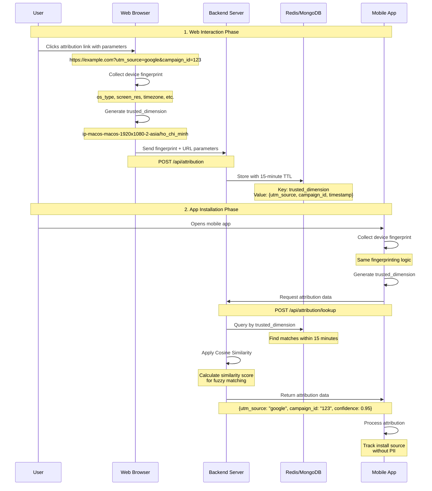
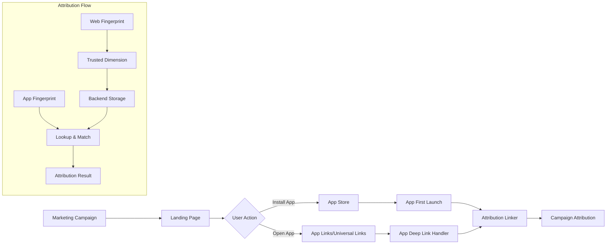
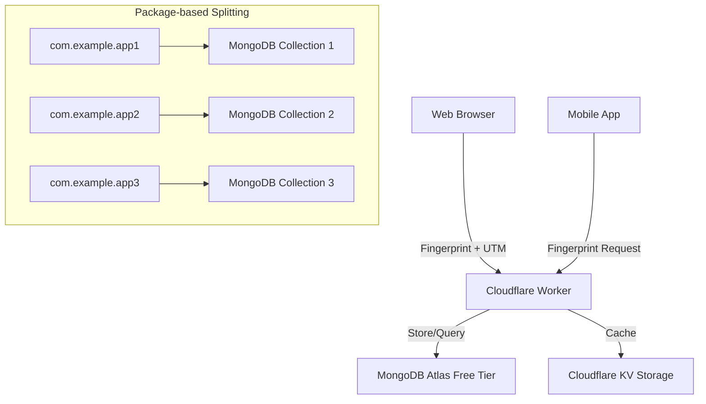

# Flutter Attribution Linker

A Flutter package for creating device fingerprints and attribution linking using WebView. This package collects device and browser information to create a unique fingerprint for attribution tracking.

## Features

- 🔍 **Device Fingerprinting**: Collects comprehensive device and browser information
- 🚀 **Headless WebView**: Uses Flutter InAppWebView for data collection
- 💾 **Caching**: Fingerprint data is cached after first collection
- 🔒 **Privacy-Aware**: Collects only standard browser API data
- 📱 **Cross-Platform**: Works on iOS and Android
- 🔗 **Post-FDL Solution**: Enhanced attribution for App Links/Universal Links after Firebase Dynamic Links discontinuation

## Installation

Add this to your package's `pubspec.yaml` file:

```yaml
dependencies:
  attribution_linker: ^0.0.1
```

## Screenshot


*Example app showing device fingerprint collection in action*

## Usage

### Basic Usage

```dart
import 'package:attribution_linker/attribution_linker.dart';

// Initialize the attribution linker
final linker = AttributionLinker();
linker.init();

// Collect fingerprint data
Map<String, dynamic> fingerprint = await linker.fingerprint;

print('Device OS: ${fingerprint['os_type']}');
print('Browser: ${fingerprint['browser_name']}');
print('Screen Resolution: ${fingerprint['screen_res']}');
```

### Fingerprint Data Structure

The fingerprint contains the following information:

- `os_type`: Operating system type (android, ios, macos, windows, linux, others)
- `os_name`: Operating system name
- `os_version`: Operating system version
- `browser_name`: Browser name
- `browser_version`: Browser version
- `device_model`: Device model
- `device_type`: Device type
- `device_arch`: Device architecture
- `device_bitness`: Device bitness (32/64 bit)
- `screen_res`: Screen resolution (e.g., "1920x1080")
- `pixel_ratio`: Device pixel ratio
- `timezone`: System timezone
- `language`: Browser language
- `cpu_cores`: Number of CPU cores
- `device_memory`: Device memory in GB
- `system_brightness`: System theme (light/dark)
- `user_agent`: Full user agent string
- And more...

## Technical Implementation

This package uses:
- **flutter_inappwebview**: For creating a headless WebView
- **UAParser.js**: For parsing user agent information
- **Navigator APIs**: For collecting device information
- **Singleton Pattern**: For efficient memory usage

## Attribution Linking Architecture

### Overview

This package implements a privacy-aware attribution linking system that connects web interactions to mobile app installations without relying on traditional tracking identifiers. The solution uses device fingerprinting to create a "trusted dimension" that serves as a matching key between web and mobile platforms.

### Technical Flow



### Key Components

#### 1. Device Fingerprinting
- **Web Side**: JavaScript APIs collect browser and device information
- **Mobile Side**: Flutter package collects equivalent device information
- **Consistency**: Both platforms use identical fingerprinting logic

#### 2. Trusted Dimension
A unique identifier created by combining:
- `ip`: User's IP address
- `os_type`: Operating system type
- `os_name`: Operating system name  
- `screen_res`: Screen resolution
- `pixel_ratio`: Device pixel ratio
- `timezone`: System timezone

Format: `ip-ostype-osname-screenres-pixelratio-timezone`

Example: `192.168.1.1-macos-macos-1920x1080-2-asia/ho_chi_minh`

#### 3. Backend Storage
```json
{
  "trusted_dimension": "192.168.1.1-macos-macos-1920x1080-2-asia/ho_chi_minh",
  "attribution_data": {
    "utm_source": "google",
    "utm_medium": "cpc", 
    "utm_campaign": "mobile_app",
    "campaign_id": "123",
    "click_id": "abc123"
  },
  "timestamp": "2024-01-15T10:30:00Z",
  "ttl": 900
}
```

#### 4. Matching Algorithm
1. **Exact Match**: Direct trusted_dimension lookup
2. **Fuzzy Match**: Cosine similarity for partial matches
3. **Time Window**: Only consider records within 15 minutes
4. **Confidence Score**: Return matching confidence level

### Benefits

- **🔒 Privacy-First**: No personal identifiers or persistent tracking
- **🎯 Accurate**: High precision through device fingerprinting
- **⚡ Fast**: Redis caching for quick lookups
- **🛡️ Secure**: Short TTL prevents long-term tracking
- **📊 Transparent**: Clear confidence scores for attribution

### Use Cases

- **App Install Attribution**: Track which marketing campaigns drive app installs
- **Cross-Platform Analytics**: Connect web and mobile user journeys
- **Campaign ROI**: Measure effectiveness of web-to-app campaigns
- **A/B Testing**: Test different onboarding flows across platforms

### Live Demo

Try the web fingerprinting demo: [https://hautvfami.github.io/attribution_linker/web_fingerprint.html](https://hautvfami.github.io/attribution_linker/web_fingerprint.html)

## Comparison with Existing Solutions

### vs Branch.io & AppsFlyer

Traditional attribution platforms like Branch.io and AppsFlyer use more complex multi-dimensional approaches:

- **✅ Their Advantages**: 
  - Multiple tracking methods (IDFA, GAID, probabilistic matching)
  - Advanced ML algorithms and cross-device tracking
  - Comprehensive analytics and fraud detection
  - Enterprise-grade infrastructure and support

- **✅ Our Advantages**:
  - **Privacy-First**: No reliance on advertising IDs or persistent tracking
  - **Cost-Effective**: Free tier options with Cloudflare Workers + MongoDB
  - **Transparent**: Open-source implementation you can audit and customize
  - **Lightweight**: Simple fingerprinting without complex device graphs

### When to Use This Solution

This package is ideal when you need:
- **Reasonable Accuracy**: 70-85% attribution accuracy for most use cases
- **Privacy Compliance**: GDPR/CCPA compliant without complex consent flows
- **Cost Control**: Predictable costs with free tier options
- **Simple Implementation**: Quick setup without extensive SDK integration

For enterprise needs requiring 95%+ accuracy, consider traditional platforms.

## Firebase Dynamic Links Alternative

### 🚨 FDL Discontinuation Impact

Firebase Dynamic Links (FDL) will be discontinued on **August 25, 2025**. This creates a significant gap for apps relying on FDL for attribution and deep linking. While App Links (Android) and Universal Links (iOS) provide deep linking functionality, they lack the attribution capabilities that FDL offered.

### 🔗 Enhanced App Links/Universal Links

This package provides the missing attribution layer for native deep links:



### Implementation Strategy

#### 1. **Landing Page Setup**
```html
<!-- Replace FDL with regular App Links -->
<script>
  // Collect fingerprint when user lands
  const fingerprint = await collectFingerprint();
  const utmParams = getURLParameters();
  
  // Store attribution data
  await storeAttribution(fingerprint, utmParams);
  
  // Redirect to App Link/Universal Link
  if (isMobile()) {
    window.location = 'https://yourapp.com/campaign?utm_source=google';
  }
</script>
```

#### 2. **App Integration**
```dart
// Replace FDL handling with Attribution Linker
class AppLinkHandler {
  static Future<void> handleAppLink(String link) async {
    // Get attribution data first
    final linker = AttributionLinker();
    final attribution = await linker.getAttributionData();
    
    // Process deep link with attribution context
    await processDeepLink(link, attribution);
  }
}
```

### Migration Benefits

- **✅ No Service Dependency**: Unlike FDL, no Google service dependency
- **✅ Cost Control**: Predictable costs vs potential FDL pricing
- **✅ Privacy Compliant**: Built-in GDPR/CCPA compliance
- **✅ Customizable**: Full control over attribution logic
- **✅ Performance**: Faster than FDL redirects

### FDL vs Attribution Linker Comparison

| Feature | Firebase Dynamic Links | Attribution Linker |
|---------|----------------------|-------------------|
| **Service Status** | ❌ Discontinued 08/25/2025 | ✅ Active Development |
| **Attribution** | ✅ Built-in | ✅ Enhanced with fingerprinting |
| **Deep Linking** | ✅ Automatic | ⚠️ Requires App Links/Universal Links |
| **Privacy** | ⚠️ Google's terms | ✅ Full privacy control |
| **Cost** | ❌ Paid service | ✅ Free tier available |
| **Customization** | ❌ Limited | ✅ Full source code access |
| **Cross-Platform** | ✅ iOS/Android | ✅ iOS/Android/Web |

## Recommended Infrastructure

### Free Tier Setup with Cloudflare + MongoDB



### Implementation Benefits

- **Cloudflare Workers**: 100k requests/day free tier, global edge computing
- **MongoDB Atlas**: 512MB free tier, sufficient for attribution data
- **Package Splitting**: Separate collections per app bundle ID for better organization
- **KV Storage**: Cache frequent lookups for faster response times

### Cost Optimization

```javascript
// Example Cloudflare Worker structure
export default {
  async fetch(request) {
    const url = new URL(request.url);
    const bundleId = url.searchParams.get('bundle_id');
    
    // Split data by package ID for better organization
    const collection = `attribution_${bundleId.replace(/\./g, '_')}`;
    
    // Use KV for caching frequent trusted_dimensions
    const cached = await KV.get(trustedDimension);
    if (cached) return new Response(cached);
    
    // MongoDB query with 15-minute TTL
    const result = await queryMongoDB(collection, trustedDimension);
    
    // Cache result for 5 minutes
    await KV.put(trustedDimension, JSON.stringify(result), {expirationTtl: 300});
    
    return new Response(JSON.stringify(result));
  }
}
```

## Privacy Considerations

This package only collects information that is freely available through standard web APIs. No personal information or unique identifiers are collected without explicit user consent.

The trusted dimension approach ensures:
- **No PII Collection**: Only technical device characteristics
- **Short Data Retention**: 15-minute TTL for attribution data
- **Opt-out Friendly**: Users can disable fingerprinting
- **GDPR Compliant**: Follows privacy-by-design principles

## Contributing

Contributions are welcome! Please feel free to submit a Pull Request.

## License

This project is licensed under the MIT License - see the LICENSE file for details.
